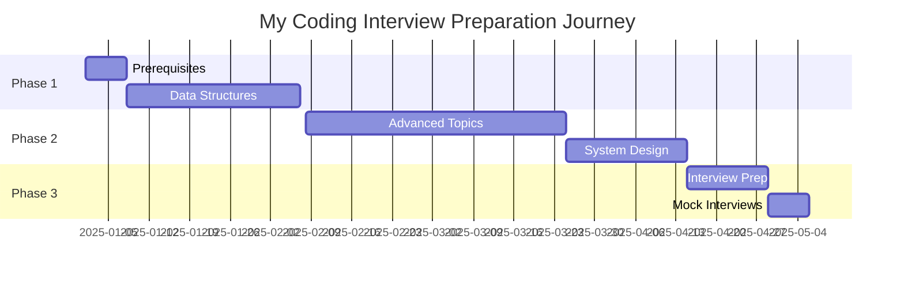

<div align="center">

# 🎓 Coding Interview University - Progress Tracker


[](https://github.com/mahmoudabozied4)
[](https://leetcode.com/your-username)
[](https://linkedin.com/in/your-profile)

> 🚀 **My journey to mastering coding interviews and landing my dream software engineering role**

</div>

---

## 📅 Journey Timeline



| **Milestone** | **Target Date** | **Status** |
|---------------|----------------|------------|
| 🎯 Start Date | `YYYY-MM-DD` | ✅ |
| 📚 Complete Data Structures | `YYYY-MM-DD` | 🔄 |
| 🧠 Master Algorithms | `YYYY-MM-DD` | ⏳ |
| 🏗️ System Design Ready | `YYYY-MM-DD` | ⏳ |
| 💼 First Interview | `YYYY-MM-DD` | ⏳ |
| 🎉 Job Offer Target | `YYYY-MM-DD` | ⏳ |

---

## 📊 Overall Progress Dashboard

<div align="center">

### 🎯 Completion Status

| Category | Progress | Status |
|----------|----------|--------|
| **📋 Prerequisites** |  | 0/3 ⏳ |
| **🗂️ Data Structures** |  | 0/8 ⏳ |
| **🧮 Algorithms** |  | 0/5 ⏳ |
| **🚀 Advanced Topics** |  | 0/12 ⏳ |
| **🏗️ System Design** |  | 0/8 ⏳ |
| **💻 Coding Practice** |  | 0/150 ⏳ |
| **🎤 Interview Prep** |  | 0/4 ⏳ |

</div>

### 📈 Weekly Study Metrics

| Week | Hours | Topics | Problems | Highlights |
|------|-------|--------|----------|------------|
| Week 1 | 0h | - | 0 | - |
| Week 2 | 0h | - | 0 | - |
| Week 3 | 0h | - | 0 | - |
| **Total** | **0h** | **0** | **0** | - |

---

## 🎯 Quick Stats

<div align="center">

| 📚 Books Read | 🎥 Videos Watched | 💡 Topics Mastered | 🏆 Mock Interviews |
|---------------|-------------------|--------------------|--------------------|
| 0 / 3 | 0 / 200+ | 0 / 50 | 0 / 5 |

</div>

---

<details open>
<summary><h2>🎯 Study Plan Progress</h2></summary>

### ✅ Prerequisites

<table>
<tr>
<td width="50%">

#### 🖥️ Programming Language Setup
- [ ] **Language:** `___________`
- [ ] **Proficiency:** `___________`
- [ ] **Books/Resources:** `___________`

</td>
<td width="50%">

#### 🛠️ Study Environment
- [ ] ✏️ Code editor/IDE configured
- [ ] 📁 GitHub repo created & organized
- [ ] 🎴 Flashcard system ready (Anki/Quizlet)
- [ ] 📊 Progress tracker setup

</td>
</tr>
</table>

#### 📖 Study Strategy
- [ ] 📚 Read: How to Use This Guide
- [ ] 🎯 Understand the daily plan
- [ ] ⏰ Set realistic goals (hours/day)
- [ ] 📅 Create personalized study schedule
- [ ] 🤝 Join study group or find accountability partner

<details>
<summary><b>📅 My Study Schedule</b></summary>

| Day | Morning (2h) | Afternoon (2h) | Evening (2h) | Focus Area |
|-----|--------------|----------------|--------------|------------|
| Mon | Theory | Practice | Review | Data Structures |
| Tue | Theory | Practice | Review | Algorithms |
| Wed | Theory | Practice | Review | Problem Solving |
| Thu | Theory | Practice | Review | System Design |
| Fri | Theory | Practice | Review | Mock Interview |
| Sat | Practice | Practice | Review | Weak Areas |
| Sun | Review | Review | Plan | Weekly Review |

</details>

</details>

---

<div align="center">

## 📚 Core Topics Mastery

</div>

### 1. Algorithmic Complexity / Big-O

**Status:** Not Started | In Progress | Completed  
**Time Spent:** ___ hours  
**Date Started:** ___  
**Date Completed:** ___

#### Videos & Resources
- [ ] Harvard CS50 - Asymptotic Notation
- [ ] Big O Notations (general quick tutorial)
- [ ] Big O Notation (mathematical explanation)
- [ ] Skiena video
- [ ] UC Berkeley Big O
- [ ] Amortized Analysis
- [ ] TopCoder - Computational Complexity
- [ ] Big-O Cheat Sheet review

#### Practice Problems
- [ ] Analyze time complexity of 5+ algorithms
- [ ] Identify Big-O of common operations
- [ ] Space complexity exercises

**Notes:**
```
[Add your key takeaways, insights, or areas to review]
```

---

### 2. Data Structures

#### 2.1 Arrays

**Status:** Not Started | In Progress | Completed  
**Time Spent:** ___ hours  
**Date Completed:** ___

##### Learning
- [ ] Arrays CS50 Harvard University
- [ ] Coursera - Arrays
- [ ] UC Berkeley CS61B - Linear and Multi-Dim Arrays
- [ ] Dynamic Arrays video
- [ ] Jagged Arrays

##### Implementation Checklist
- [ ] Implement a vector (dynamic array)
  - [ ] size() - number of items
  - [ ] capacity() - number of items it can hold
  - [ ] is_empty()
  - [ ] at(index) - returns item at index
  - [ ] push(item) - add to end
  - [ ] insert(index, item) - insert at index
  - [ ] prepend(item) - insert at beginning
  - [ ] pop() - remove from end
  - [ ] delete(index) - delete item at index
  - [ ] remove(item) - remove by value
  - [ ] find(item) - find index of value
  - [ ] resize(new_capacity) - private function

##### Practice Problems Solved
- [ ] Problem 1: _______________
- [ ] Problem 2: _______________
- [ ] Problem 3: _______________
- [ ] Problem 4: _______________
- [ ] Problem 5: _______________

**Code Location:** `[path/to/your/code]`

---

#### 2.2 Linked Lists

**Status:** Not Started | In Progress | Completed  
**Time Spent:** ___ hours  
**Date Completed:** ___

##### Learning
- [ ] Linked Lists CS50 Harvard
- [ ] Singly Linked Lists (Coursera)
- [ ] CS 61B - Linked Lists 1
- [ ] CS 61B - Linked Lists 2
- [ ] Linked lists review (4 minutes)
- [ ] C Code video
- [ ] Linked Lists vs Arrays comparison

##### Implementation Checklist
- [ ] Implement singly-linked list
  - [ ] size() - returns number of elements
  - [ ] empty() - bool returns true if empty
  - [ ] value_at(index) - returns value at nth item
  - [ ] push_front(value) - adds item to front
  - [ ] pop_front() - remove front item
  - [ ] push_back(value) - adds item at end
  - [ ] pop_back() - removes end item
  - [ ] front() - get value of front item
  - [ ] back() - get value of end item
  - [ ] insert(index, value) - insert value at index
  - [ ] erase(index) - removes node at index
  - [ ] value_n_from_end(n) - returns value n positions from end
  - [ ] reverse() - reverses the list
  - [ ] remove_value(value) - removes first item with this value

##### Practice Problems Solved
- [ ] Problem 1: _______________
- [ ] Problem 2: _______________
- [ ] Problem 3: _______________
- [ ] Problem 4: _______________
- [ ] Problem 5: _______________

**Code Location:** `[path/to/your/code]`

---

#### 2.3 Stack

**Status:** Not Started | In Progress | Completed  
**Time Spent:** ___ hours  
**Date Completed:** ___

##### Learning
- [ ] Stacks video (Coursera)
- [ ] Stacks review (3 minutes)
- [ ] Understanding array-based implementation

##### Implementation
- [ ] Understand stack operations
- [ ] Implement using arrays (trivial)
- [ ] Practice stack-based problems

##### Practice Problems Solved
- [ ] Problem 1: _______________
- [ ] Problem 2: _______________
- [ ] Problem 3: _______________

**Code Location:** `[path/to/your/code]`

---

#### 2.4 Queue

**Status:** Not Started | In Progress | Completed  
**Time Spent:** ___ hours  
**Date Completed:** ___

##### Learning
- [ ] Queue video (Coursera)
- [ ] Circular buffer/FIFO
- [ ] Queues review (3 minutes)

##### Implementation Checklist
- [ ] Implement using linked-list with tail pointer
  - [ ] enqueue(value) - adds at tail
  - [ ] dequeue() - removes from front
  - [ ] empty()
- [ ] Implement using fixed-sized array
  - [ ] enqueue(value) - adds at end
  - [ ] dequeue() - removes from front
  - [ ] empty()
  - [ ] full()

##### Practice Problems Solved
- [ ] Problem 1: _______________
- [ ] Problem 2: _______________
- [ ] Problem 3: _______________

**Code Location:** `[path/to/your/code]`

---

#### 2.5 Hash Table

**Status:** Not Started | In Progress | Completed  
**Time Spent:** ___ hours  
**Date Completed:** ___

##### Learning
- [ ] Hashing with Chaining
- [ ] Table Doubling, Karp-Rabin
- [ ] Open Addressing, Cryptographic Hashing
- [ ] PyCon 2010: The Mighty Dictionary
- [ ] PyCon 2017: Dictionary Even Mightier
- [ ] Core Hash Tables (Coursera)
- [ ] Phone Book Problem
- [ ] Hash tables review (4 minutes)

##### Implementation Checklist
- [ ] Implement with array using linear probing
  - [ ] hash(k, m) - hash function
  - [ ] add(key, value) - adds or updates
  - [ ] exists(key)
  - [ ] get(key)
  - [ ] remove(key)

##### Practice Problems Solved
- [ ] Problem 1: _______________
- [ ] Problem 2: _______________
- [ ] Problem 3: _______________
- [ ] Problem 4: _______________
- [ ] Problem 5: _______________

**Code Location:** `[path/to/your/code]`

---

### 3. More Knowledge

#### 3.1 Binary Search

**Status:** Not Started | In Progress | Completed  
**Time Spent:** ___ hours  
**Date Completed:** ___

##### Learning
- [ ] Binary Search video 1
- [ ] Binary Search video 2
- [ ] Khan Academy
- [ ] TopCoder detail
- [ ] LeetCode template/blueprint
- [ ] Binary search review (4 minutes)

##### Implementation
- [ ] Binary search on sorted array (iterative)
- [ ] Binary search using recursion

##### Practice Problems Solved
- [ ] Problem 1: _______________
- [ ] Problem 2: _______________
- [ ] Problem 3: _______________
- [ ] Problem 4: _______________
- [ ] Problem 5: _______________

**Code Location:** `[path/to/your/code]`

---

#### 3.2 Bitwise Operations

**Status:** Not Started | In Progress | Completed  
**Time Spent:** ___ hours  
**Date Completed:** ___

##### Learning
- [ ] Bits cheat sheet review
- [ ] Understanding &, |, ^, ~, >>, <<
- [ ] Bit Manipulation video
- [ ] C Programming Tutorial - Bitwise Operators
- [ ] Bit Manipulation techniques
- [ ] The Bit Twiddler
- [ ] Bit Hacks video
- [ ] Practice Operations
- [ ] 2s and 1s complement
- [ ] Count set bits
- [ ] Swap values
- [ ] Absolute value

##### Practice Problems Solved
- [ ] Problem 1: _______________
- [ ] Problem 2: _______________
- [ ] Problem 3: _______________
- [ ] Problem 4: _______________
- [ ] Problem 5: _______________

**Code Location:** `[path/to/your/code]`

---

### 4. Trees

#### 4.1 Trees - Introduction & Traversal

**Status:** Not Started | In Progress | Completed  
**Time Spent:** ___ hours  
**Date Completed:** ___

##### Learning
- [ ] Intro to Trees (Coursera)
- [ ] Tree Traversal (Coursera)
- [ ] BFS and DFS video
- [ ] BFS review (4 minutes)
- [ ] DFS review (4 minutes)
- [ ] Tree Traversal playlist (11 minutes)
- [ ] Understanding traversal types:
  - [ ] Inorder (DFS: left, self, right)
  - [ ] Postorder (DFS: left, right, self)
  - [ ] Preorder (DFS: self, left, right)
  - [ ] Level order (BFS, using queue)

##### Practice Problems Solved
- [ ] Problem 1: _______________
- [ ] Problem 2: _______________
- [ ] Problem 3: _______________

---

#### 4.2 Binary Search Trees (BSTs)

**Status:** Not Started | In Progress | Completed  
**Time Spent:** ___ hours  
**Date Completed:** ___

##### Learning
- [ ] Binary Search Tree Review
- [ ] Introduction (Coursera)
- [ ] MIT video
- [ ] C/C++ implementation videos (series)
- [ ] BST implementation in your language

##### Implementation Checklist
- [ ] insert - insert value into tree
- [ ] get_node_count - get count of values
- [ ] print_values - prints values min to max
- [ ] delete_tree
- [ ] is_in_tree - returns true if value exists
- [ ] get_height - returns height in nodes
- [ ] get_min - returns minimum value
- [ ] get_max - returns maximum value
- [ ] is_binary_search_tree
- [ ] delete_value
- [ ] get_successor - next-highest value after given value

##### Practice Problems Solved
- [ ] Problem 1: _______________
- [ ] Problem 2: _______________
- [ ] Problem 3: _______________
- [ ] Problem 4: _______________
- [ ] Problem 5: _______________

**Code Location:** `[path/to/your/code]`

---

#### 4.3 Heap / Priority Queue / Binary Heap

**Status:** Not Started | In Progress | Completed  
**Time Spent:** ___ hours  
**Date Completed:** ___

##### Learning
- [ ] Heap introduction (Coursera)
- [ ] Binary Trees (Coursera)
- [ ] Tree Height Remark
- [ ] Basic Operations
- [ ] Complete Binary Trees
- [ ] Pseudocode
- [ ] Heap Sort video
- [ ] Building a heap
- [ ] MIT Introduction to Heaps
- [ ] Heap review playlist (13 minutes)

##### Implementation Checklist
- [ ] Implement a max-heap:
  - [ ] insert
  - [ ] sift_up - needed for insert
  - [ ] get_max - returns max without removing
  - [ ] get_size() - return number of elements
  - [ ] is_empty() - returns true if empty
  - [ ] extract_max - returns max and removes it
  - [ ] sift_down - needed for extract_max
  - [ ] remove(x) - removes item at index x
  - [ ] heapify - create heap from array
  - [ ] heap_sort() - sort using heap

##### Practice Problems Solved
- [ ] Problem 1: _______________
- [ ] Problem 2: _______________
- [ ] Problem 3: _______________
- [ ] Problem 4: _______________
- [ ] Problem 5: _______________

**Code Location:** `[path/to/your/code]`

---

### 5. Sorting

**Status:** Not Started | In Progress | Completed  
**Time Spent:** ___ hours  
**Date Completed:** ___

##### Learning
- [ ] Sedgewick - Mergesort (5 videos)
- [ ] Sedgewick - Quicksort (4 videos)
- [ ] UC Berkeley sorting lectures (4 videos)
- [ ] Bubble Sort
- [ ] Analyzing Bubble Sort
- [ ] Insertion Sort, Merge Sort
- [ ] Quicksort
- [ ] Selection Sort
- [ ] Sorting review playlist (18 minutes)

##### Key Concepts Mastered
- [ ] Understand stability in sorting
- [ ] Know which sorts work on linked lists vs arrays
- [ ] Time complexity of each sort
- [ ] Space complexity of each sort
- [ ] When to use each algorithm

##### Implementation Checklist
- [ ] Mergesort: O(n log n) average and worst
  - [ ] Using output array (C)
  - [ ] Using output array (Python)
  - [ ] In-place (C++)
- [ ] Quicksort: O(n log n) average
  - [ ] Implementation (C)
  - [ ] Implementation (Python)
- [ ] Understand Selection sort O(n²)
- [ ] Understand Insertion sort O(n²)
- [ ] Heapsort (see Heap section)

##### Practice Problems Solved
- [ ] Problem 1: _______________
- [ ] Problem 2: _______________
- [ ] Problem 3: _______________
- [ ] Problem 4: _______________
- [ ] Problem 5: _______________

**Code Location:** `[path/to/your/code]`

---

### 6. Graphs

**Status:** Not Started | In Progress | Completed  
**Time Spent:** ___ hours  
**Date Completed:** ___

##### Learning
- [ ] MIT - Breadth-First Search
- [ ] MIT - Depth-First Search
- [ ] Skiena - Graph Data Structures
- [ ] Skiena - Graph Traversal
- [ ] Skiena - Depth First Search
- [ ] Skiena - Minimum Spanning Trees
- [ ] Graph algorithms videos (series)
- [ ] Shortest Path Algorithms playlist (16 minutes)
- [ ] Minimum Spanning Trees playlist (4 minutes)

##### Key Concepts
- [ ] 4 ways to represent graphs in memory:
  - [ ] Objects and pointers
  - [ ] Adjacency matrix
  - [ ] Adjacency list
  - [ ] Adjacency map
- [ ] BFS and DFS complexity and tradeoffs
- [ ] Directed vs Undirected graphs

##### Implementation Checklist
- [ ] DFS with adjacency list (recursive)
- [ ] DFS with adjacency list (iterative with stack)
- [ ] DFS with adjacency matrix (recursive)
- [ ] DFS with adjacency matrix (iterative)
- [ ] BFS with adjacency list
- [ ] BFS with adjacency matrix
- [ ] Single-source shortest path (Dijkstra)
- [ ] Minimum spanning tree
- [ ] Check for cycle
- [ ] Topological sort
- [ ] Count connected components
- [ ] List strongly connected components
- [ ] Check for bipartite graph

##### Practice Problems Solved
- [ ] Problem 1: _______________
- [ ] Problem 2: _______________
- [ ] Problem 3: _______________
- [ ] Problem 4: _______________
- [ ] Problem 5: _______________
- [ ] Problem 6: _______________
- [ ] Problem 7: _______________
- [ ] Problem 8: _______________
- [ ] Problem 9: _______________
- [ ] Problem 10: _______________

**Code Location:** `[path/to/your/code]`

---

## 🚀 Even More Knowledge

### 7. Recursion

**Status:** Not Started | In Progress | Completed  
**Time Spent:** ___ hours  
**Date Completed:** ___

##### Learning
- [ ] Stanford lectures on recursion (4 lectures)
- [ ] When to use recursion
- [ ] Tail recursion understanding
- [ ] 5 Simple Steps for Solving Recursive Problems
- [ ] Backtracking blueprint (Java/Python)

##### Practice Problems Solved
- [ ] Problem 1: _______________
- [ ] Problem 2: _______________
- [ ] Problem 3: _______________
- [ ] Problem 4: _______________
- [ ] Problem 5: _______________

---

### 8. Dynamic Programming

**Status:** Not Started | In Progress | Completed  
**Time Spent:** ___ hours  
**Date Completed:** ___

##### Learning
- [ ] Skiena - Introduction to DP
- [ ] Skiena - Edit Distance
- [ ] Skiena - DP Examples
- [ ] Simonson - DP videos (4 lectures)
- [ ] DP problems playlist
- [ ] Yale Lecture notes
- [ ] Coursera - RNA problem
- [ ] Coursera - DP algorithm videos

##### Key Concepts
- [ ] Recognize DP problems
- [ ] Define recursion relation
- [ ] Memoization vs Tabulation
- [ ] Common DP patterns

##### Practice Problems Solved
- [ ] Problem 1: _______________
- [ ] Problem 2: _______________
- [ ] Problem 3: _______________
- [ ] Problem 4: _______________
- [ ] Problem 5: _______________
- [ ] Problem 6: _______________
- [ ] Problem 7: _______________
- [ ] Problem 8: _______________
- [ ] Problem 9: _______________
- [ ] Problem 10: _______________

---

### 9. Design Patterns

**Status:** Not Started | In Progress | Completed  
**Time Spent:** ___ hours  
**Date Completed:** ___

##### Learning
- [ ] Quick UML review
- [ ] Design Patterns series (27 videos)
- [ ] Optional: Head First Design Patterns book

##### Patterns Learned
- [ ] Strategy
- [ ] Singleton
- [ ] Adapter
- [ ] Prototype
- [ ] Decorator
- [ ] Visitor
- [ ] Factory, Abstract Factory
- [ ] Facade
- [ ] Observer
- [ ] Proxy
- [ ] Delegate
- [ ] Command
- [ ] State
- [ ] Memento
- [ ] Iterator
- [ ] Composite
- [ ] Flyweight

---

### 10. Combinatorics & Probability

**Status:** Not Started | In Progress | Completed  
**Time Spent:** ___ hours  
**Date Completed:** ___

##### Learning
- [ ] Math Skills: Factorial, Permutation, Combination
- [ ] Make School: Probability
- [ ] Make School: Markov Chains
- [ ] Khan Academy: Basic Theoretical Probability
- [ ] Probability Explained playlist

---

### 11. NP, NP-Complete & Approximation Algorithms

**Status:** Not Started | In Progress | Completed  
**Time Spent:** ___ hours  
**Date Completed:** ___

##### Learning
- [ ] Computational Complexity
- [ ] Simonson NP-Completeness videos (4 lectures)
- [ ] Skiena NP-Completeness videos (4 lectures)
- [ ] Complexity: P, NP, NP-completeness
- [ ] Approximation Algorithms
- [ ] Fixed-Parameter Algorithms
- [ ] Traveling Salesman Problem

##### Famous NP-Complete Problems
- [ ] Traveling Salesman Problem
- [ ] Knapsack Problem
- [ ] Understanding NP-Complete recognition

---

### 12. Additional Topics

#### How Computers Process Programs
**Status:** Not Started | Completed  
- [ ] How CPU executes a program
- [ ] How computers calculate - ALU
- [ ] Registers and RAM
- [ ] The Central Processing Unit
- [ ] Instructions and Programs

#### Caches
**Status:** Not Started | Completed  
- [ ] LRU Cache videos (3 videos)
- [ ] CPU cache (MIT videos)

#### Processes and Threads
**Status:** Not Started | Completed  
- [ ] CS 162 - Operating Systems (videos 1-11)
- [ ] Process vs Thread understanding
- [ ] Concurrency concepts
- [ ] Context switching
- [ ] Threading in your language

#### Testing
**Status:** Not Started | Completed  
- [ ] Unit testing concepts
- [ ] Mock objects
- [ ] Integration testing
- [ ] Dependency injection
- [ ] TDD understanding

#### String Searching & Manipulation
**Status:** Not Started | Completed  
- [ ] Sedgewick - Suffix Arrays
- [ ] Sedgewick - Substring Search (5 videos)
- [ ] Rabin-Karp algorithm
- [ ] Knuth-Morris-Pratt (KMP)
- [ ] Boyer-Moore algorithm

#### Tries
**Status:** Not Started | Completed  
- [ ] Sedgewick - Tries (3 videos)
- [ ] Introduction to Tries
- [ ] Performance of Tries
- [ ] Implementing a Trie

#### Floating Point Numbers
**Status:** Not Started | Completed  
- [ ] 8-bit representation
- [ ] Understanding floating point

#### Unicode
**Status:** Not Started | Completed  
- [ ] Absolute minimum about Unicode
- [ ] Character sets and encodings

#### Endianness
**Status:** Not Started | Completed  
- [ ] Big and Little Endian
- [ ] Endian comparison

#### Networking
**Status:** Not Started | Completed  
- [ ] Khan Academy basics
- [ ] UDP and TCP comparison
- [ ] TCP/IP and OSI Model
- [ ] HTTP, SSL/TLS
- [ ] Networking fundamentals

---

## 💼 System Design, Scalability, Data Handling

**Status:** Not Started | In Progress | Completed  
**Time Spent:** ___ hours  
**Date Completed:** ___

##### Learning Resources
- [ ] The System Design Primer (GitHub)
- [ ] HiredInTech System Design
- [ ] 8 steps guide to ace system design
- [ ] Database Normalization
- [ ] How to ace a systems design interview
- [ ] Numbers Everyone Should Know
- [ ] CAP Theorem
- [ ] Consensus Algorithms (Paxos, Raft)
- [ ] Consistent Hashing
- [ ] NoSQL Patterns

##### Scalability Topics
- [ ] Scalability overview video
- [ ] Clones, Database, Cache, Asynchronism
- [ ] Scalable Web Architecture
- [ ] Distributed Systems introduction
- [ ] Google system design lessons

##### Practice Design Problems
- [ ] Design a random unique ID generation system
- [ ] Design a key-value database
- [ ] Design a picture sharing system
- [ ] Design a recommendation system
- [ ] Design a URL-shortener system
- [ ] Design a cache system

**Design Notes:**
```
[Document your system design approaches and learnings]
```

---

## 🎯 Coding Practice Tracking

### Platform: LeetCode
**Profile:** _[your profile link]_

#### Easy Problems (Target: 50)
**Completed:** 0/50

| # | Problem | Date | Difficulty | Time | Notes |
|---|---------|------|------------|------|-------|
| 1 | | | Easy | | |
| 2 | | | Easy | | |
| 3 | | | Easy | | |

#### Medium Problems (Target: 75)
**Completed:** 0/75

| # | Problem | Date | Difficulty | Time | Notes |
|---|---------|------|------------|------|-------|
| 1 | | | Medium | | |
| 2 | | | Medium | | |
| 3 | | | Medium | | |

#### Hard Problems (Target: 25)
**Completed:** 0/25

| # | Problem | Date | Difficulty | Time | Notes |
|---|---------|------|------------|------|-------|
| 1 | | | Hard | | |
| 2 | | | Hard | | |

---

### Platform: HackerRank
**Profile:** _[your profile link]_
**Problems Solved:** 0

---

### Platform: TopCoder
**Profile:** _[your profile link]_
**Rating:** ___

---

## 📖 Books Reading Progress

### Technical Interview Books

#### Cracking the Coding Interview (6th Edition)
**Status:** Not Started | Reading | Completed  
**Progress:** ___/189 questions

- [ ] Arrays and Strings
- [ ] Linked Lists
- [ ] Stacks and Queues
- [ ] Trees and Graphs
- [ ] Bit Manipulation
- [ ] Math and Logic Puzzles
- [ ] Object-Oriented Design
- [ ] Recursion and Dynamic Programming
- [ ] System Design and Scalability
- [ ] Sorting and Searching
- [ ] Testing
- [ ] C and C++
- [ ] Java
- [ ] Databases
- [ ] Threads and Locks
- [ ] Moderate Problems
- [ ] Hard Problems

---

#### Programming Interviews Exposed (4th Edition)
**Status:** Not Started | Reading | Completed  
**Progress:** ___/___ chapters

---

#### Elements of Programming Interviews (Your Language)
**Status:** Not Started | Reading | Completed  
**Progress:** ___/___ chapters

---

### Algorithm Books

#### Algorithm Design Manual (Skiena)
**Status:** Not Started | Reading | Completed  
**Progress:** ___/___ chapters

---

#### Algorithms (Sedgewick)
**Status:** Not Started | Reading | Completed  
**Progress:** ___/___ chapters

---

## 🎤 Interview Preparation

### Resume
- [ ] Resume updated with latest experience
- [ ] Resume reviewed by peers
- [ ] Resume tailored for target companies
- [ ] GitHub profile updated
- [ ] LinkedIn profile optimized

### Mock Interviews
- [ ] Mock Interview 1: ___ (Date) - Feedback: ___
- [ ] Mock Interview 2: ___ (Date) - Feedback: ___
- [ ] Mock Interview 3: ___ (Date) - Feedback: ___
- [ ] Mock Interview 4: ___ (Date) - Feedback: ___
- [ ] Mock Interview 5: ___ (Date) - Feedback: ___

**Platforms Used:**
- [ ] Pramp
- [ ] Interviewing.io
- [ ] Gainlo
- [ ] Friends/Colleagues

### Behavioral Interview Prep

#### STAR Stories Prepared
- [ ] Story 1: Challenge you overcame
- [ ] Story 2: Team conflict resolution
- [ ] Story 3: Leadership example
- [ ] Story 4: Failure and learning
- [ ] Story 5: Technical achievement
- [ ] Story 6: Project you're proud of

#### Questions for Interviewers
- [ ] Prepared 10+ questions for interviewers
- [ ] Questions about team structure
- [ ] Questions about tech stack
- [ ] Questions about culture
- [ ] Questions about growth opportunities

---

## 🎯 Target Companies

| Company | Status | Resume Sent | Interview Stage | Notes |
|---------|--------|-------------|-----------------|-------|
| | | | | |
| | | | | |
| | | | | |
| | | | | |

**Status Options:** Target | Applied | Phone Screen | Technical | Onsite | Offer | Rejected

---

## 📊 Weekly Progress Review

### Week 1 (Dates: ___ to ___)
**Hours Studied:** ___  
**Topics Covered:**
- 
- 
- 

**Problems Solved:** ___  
**Reflection:**
```
[What went well? What needs improvement?]
```

---

### Week 2 (Dates: ___ to ___)
**Hours Studied:** ___  
**Topics Covered:**
- 
- 
- 

**Problems Solved:** ___  
**Reflection:**
```
[What went well? What needs improvement?]
```

---

## 🎓 Additional Resources Completed

### Online Courses
- [ ] Course 1: _______________ (Platform: ___)
- [ ] Course 2: _______________ (Platform: ___)
- [ ] Course 3: _______________ (Platform: ___)

### Video Series
- [ ] MIT 6.006: Introduction to Algorithms
- [ ] MIT 6.046: Design and Analysis of Algorithms
- [ ] Stanford Algorithm Specialization
- [ ] UC Berkeley CS61B

### Papers Read
- [ ] Google File System
- [ ] MapReduce
- [ ] Bigtable
- [ ] Dynamo
- [ ] Additional papers: ___

---

## 💡 Key Learnings & Insights

### Important Patterns Identified
1. 
2. 
3. 
4. 
5. 

### Common Mistakes to Avoid
1. 
2. 
3. 
4. 
5. 

### Personal Strengths
1. 
2. 
3. 

### Areas for Improvement
1. 
2. 
3. 

---

## 📈 Study Statistics

**Total Study Time:** ___ hours  
**Average Daily Study Time:** ___ hours  
**Total Problems Solved:** ___  
**Favorite Topics:** ___  
**Most Challenging Topics:** ___

---

## 🎉 Milestones Achieved

- [ ] Completed all core data structures
- [ ] Solved 100 LeetCode problems
- [ ] Finished first technical book
- [ ] Completed system design section
- [ ] Had first mock interview
- [ ] Solved first hard problem
- [ ] Got first interview call
- [ ] Completed entire curriculum
- [ ] Received job offer!

---

## 📝 Daily Study Log

### Template for Daily Entries

**Date:** ___  
**Study Time:** ___ hours  
**Topics:** ___  
**Problems Solved:** ___  
**Struggles:** ___  
**Wins:** ___  
**Tomorrow's Plan:** ___

---

## 🔄 Review Schedule

- [ ] Week 1 Review: ___ (Date)
- [ ] Week 2 Review: ___ (Date)
- [ ] Week 4 Review: ___ (Date)
- [ ] Month 1 Review: ___ (Date)
- [ ] Month 2 Review: ___ (Date)
- [ ] Month 3 Review: ___ (Date)
- [ ] Pre-Interview Review: ___ (Date)

---

## 📚 Flashcard Deck Progress

**Total Cards Created:** ___  
**Cards Mastered:** ___  
**Cards In Progress:** ___

**Topics with Flashcards:**
- [ ] Big-O Complexities
- [ ] Data Structure Operations
- [ ] Algorithm Time/Space Complexity
- [ ] Common Patterns
- [ ] Key Formulas
- [ ] System Design Concepts

---

## 🎯 Monthly Goals

### Month 1
- [ ] Goal 1: ___
- [ ] Goal 2: ___
- [ ] Goal 3: ___

### Month 2
- [ ] Goal 1: ___
- [ ] Goal 2: ___
- [ ] Goal 3: ___

### Month 3
- [ ] Goal 1: ___
- [ ] Goal 2: ___
- [ ] Goal 3: ___

---

## 📞 Interview Tracker

### Company: ___________

**Application Date:** ___  
**Response Date:** ___

#### Interview Rounds
1. **Phone Screen** (Date: ___)
   - Duration: ___
   - Topics: ___
   - Result: ___
   - Feedback: ___

2. **Technical Interview 1** (Date: ___)
   - Duration: ___
   - Topics: ___
   - Problems: ___
   - Result: ___
   - Feedback: ___

3. **Technical Interview 2** (Date: ___)
   - Duration: ___
   - Topics: ___
   - Problems: ___
   - Result: ___
   - Feedback: ___

4. **System Design** (Date: ___)
   - Duration: ___
   - Problem: ___
   - Result: ___
   - Feedback: ___

5. **Behavioral** (Date: ___)
   - Duration: ___
   - Questions: ___
   - Result: ___
   - Feedback: ___

**Final Result:** ___  
**Offer Details:** ___

---

## 🎓 Certification & Achievements

- [ ] Completed Coursera Algorithm Specialization
- [ ] Earned LeetCode badges: ___
- [ ] HackerRank certifications: ___
- [ ] Other achievements: ___

---

## 🤝 Study Group / Accountability

**Study Partners:** ___  
**Check-in Schedule:** ___  
**Shared Goals:** ___

---

## 💪 Motivation & Reminders

### Why I'm Doing This
```
[Write your personal motivation and goals]
```

### Inspirational Quotes
- "The only way to do great work is to love what you do." - Steve Jobs
- "Success is not final, failure is not fatal: it is the courage to continue that counts." - Winston Churchill
- [Add your own]

### On Difficult Days, Remember:
- You've come this far
- Every problem solved is progress
- Consistency beats intensity
- It's okay to take breaks
- [Add your own]

---

## 📅 Study Schedule

### Weekly Schedule Template

| Day | Morning | Afternoon | Evening | Topics | Problems |
|-----|---------|-----------|---------|--------|----------|
| Mon | | | | | |
| Tue | | | | | |
| Wed | | | | | |
| Thu | | | | | |
| Fri | | | | | |
| Sat | | | | | |
| Sun | | | | | |

---

## 🏆 Final Checklist Before Interviews

### Technical Preparation
- [ ] Can implement all basic data structures from scratch
- [ ] Comfortable with Big-O analysis
- [ ] Practiced 150+ coding problems
- [ ] Can solve medium problems in 30-45 minutes
- [ ] Comfortable with system design basics
- [ ] Reviewed all common algorithms
- [ ] Practiced coding on whiteboard/paper
- [ ] Can explain code clearly while writing

### Soft Skills
- [ ] Prepared STAR stories
- [ ] Can articulate thought process clearly
- [ ] Practiced asking clarifying questions
- [ ] Can handle hints gracefully
- [ ] Comfortable admitting when stuck
- [ ] Prepared questions for interviewers

### Logistics
- [ ] Resume updated and reviewed
- [ ] References contacted
- [ ] Interview outfit ready
- [ ] Technology tested (for remote interviews)
- [ ] Company research completed
- [ ] Travel/accommodation arranged (if needed)

---

## 📊 Progress Visualization

Create your own charts or use tools to visualize:
- Problems solved per week
- Study hours per week
- Topics completed over time
- Mock interview scores

---

## 🎯 Success Definition

**My definition of success for this journey:**
```
[Define what success means to you - not just getting a job, but also learning, growth, etc.]
```

**Minimum acceptable outcome:** ___  
**Ideal outcome:** ___  
**Stretch goal:** ___

---

## 📌 Important Links & Resources

**Code Repository:** ___  
**Flashcard System:** ___  
**Study Notes:** ___  
**Practice Platforms:** ___

---

## 🔄 Review & Reflection

### What's Working Well?
1. 
2. 
3. 

### What Needs Adjustment?
1. 
2. 
3. 

### Action Items
- [ ] 
- [ ] 
- [ ] 

---

**Last Updated:** ___  
**Next Review Date:** ___

---

> "The expert in anything was once a beginner." - Helen Hayes

> Remember: This is a marathon, not a sprint. Consistency and quality practice matter more than speed. Trust the process, stay dedicated, and you will succeed!

**Good luck on your journey! 🚀**
